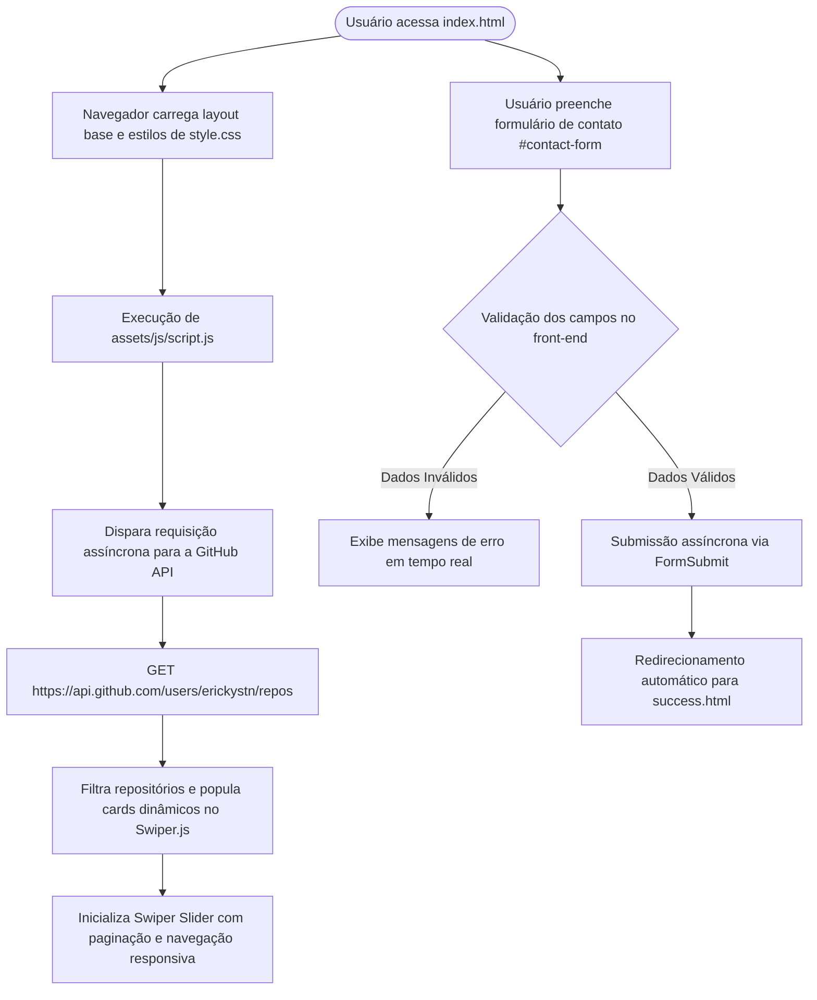

# Projeto Portfólio Pessoal

<br />

<div align="center">

[](https://erickystn.github.io/portfolio_generation/)
[](https://developer.mozilla.org/pt-BR/docs/Web/HTML)
[](https://developer.mozilla.org/pt-BR/docs/Web/CSS)
[](https://developer.mozilla.org/pt-BR/docs/Web/JavaScript)
[](https://swiperjs.com/)
[](https://docs.github.com/pt/rest)
[](https://brazil.generation.org/)
[](LICENSE)
[](#)

</div>

---

<details open>
  <summary><strong>👨‍💻 Apresentação Visual do Portfólio</strong></summary>

  <br />

  <div align="center">
    
  </div>

</details>

<br />

<details>
  <summary><strong>✅ Tela de Confirmação de Envio (success.html)</strong></summary>

  <br />

  <div align="center">
    
  </div>

</details>

---

O **Projeto Portfólio Pessoal** é um **site profissional moderno**, desenvolvido com **HTML, CSS e JavaScript**, com o objetivo de apresentar informações sobre a pessoa desenvolvedora, seus projetos e formas de contato de maneira clara, interativa e responsiva.

O projeto consome dados dinâmicos da **API do GitHub**, permitindo que informações como perfil e repositórios sejam carregadas automaticamente, mantendo o conteúdo sempre atualizado.

---

## Funcionalidades

- Estrutura de páginas desenvolvida com **HTML semântico**
- Estilização moderna com **CSS**, utilizando:
  - Variáveis CSS
  - Animações
  - Layout responsivo (desktop, tablet e mobile)
- Integração com a **API do GitHub** para:
  - Exibição dinâmica das informações do perfil
  - Listagem automática dos repositórios
- Exibição dos projetos em **carrossel interativo** utilizando **Swiper.js**
- **Formulário de contato com validação no frontend**, garantindo o correto preenchimento dos campos
- Página dedicada de **confirmação de envio** do formulário
- Navegação fluida com menu fixo e rolagem suave
- Interface intuitiva e organizada, focada na experiência do usuário

---

## 🔄 Fluxo de Integração e Carregamento Dinâmico



---

## Estrutura do Projeto

```
📁portfolio/
│
├── index.html        # Página principal do portfólio
├── success.html      # Página de confirmação de envio do formulário
│
├── 📁assets/
│   ├── 📁css/
│   │   └── style.css     # Estilos e responsividade
│   ├── 📁js/
│   │   └── script.js     # Integração com GitHub, carrossel e validações
│   ├── 📁img/            # Imagens e ilustrações
│   └── 📁icons/          # Ícones das linguagens e redes sociais
│
└── README.md
```

### Detalhamento da Estrutura de Diretórios

```bash
portfolio_generation/
├── index.html                                 # Página principal (Hero, Sobre, Projetos com Swiper, Contato)
├── success.html                               # Feedback visual e mensagem de agradecimento pós-envio
├── README.md                                  # Documentação técnica completa
└── assets/
    ├── css/
    │   └── style.css                          # Variáveis CSS (:root), animações flutuantes (@keyframes float) e media queries
    ├── js/
    │   └── script.js                          # Consumo da API do GitHub, integração do Swiper e validação de formulário
    ├── img/
    │   ├── avatar_dev_man.svg                 # Ilustração de avatar
    │   ├── avatar_dev_woman.svg
    │   ├── eu.png                             # Foto de perfil real do desenvolvedor
    │   ├── favicon.svg                        # Ícone vetorial da aba do navegador
    │   ├── foto_dev_man.svg                   # Ilustração principal da seção Hero
    │   ├── foto_dev_woman.svg
    │   └── success.svg                        # Ícone da tela de confirmação de mensagem
    ├── icons/                                 # Ícones vetoriais de linguagens e tecnologias
    └── docs/                                  # Guias aprofundados por tecnologia
        ├── html/README.md                     # Documentação semântica de tags HTML utilizadas
        ├── css/README.md                      # Tabela completa de propriedades e classes CSS
        └── js/README.md                       # Documentação dos métodos assíncronos e eventos
```

---

## Tecnologias Utilizadas

- **HTML5**: Estruturação semântica do conteúdo
- **CSS3**: Estilização, layout responsivo e animações
- **JavaScript (ES6+)**: Interatividade, consumo de APIs e validações
- **Swiper.js**: Carrossel de projetos responsivo
- **FormSubmit:** Serviço de envio de e-mails via formulário HTML
- **GitHub API**: Fonte dinâmica de dados do perfil e repositórios

---

## Executando Localmente

Para executar o projeto em ambiente local, siga os passos abaixo.

### Pré-requisitos

- [Visual Studio Code](https://code.visualstudio.com/) (ou outro editor de sua preferência)
- Extensão **Live Server** instalada no VS Code
- [Git](https://git-scm.com/) instalado

### Passos

1. Clone o repositório:

   ```bash
   git clone https://github.com/erickystn/portfolio_generation.git
   ```

2. Acesse a pasta do projeto:

   ```bash
   cd portfolio_generation
   ```

3. Abra o projeto no Visual Studio Code:

   ```bash
   code .
   ```

4. Abra o arquivo `index.html`, clique com o botão direito e selecione **"Open with Live Server"**.

O site será aberto no navegador e todas as alterações poderão ser visualizadas em tempo real.

---

## Documentação Técnica

1. [Estrutura do HTML](./assets/docs/html/README.md)
2. [Estilização com CSS](./assets/docs/css/README.md)
3. [Script JS](./assets/docs/js/README.md)

---

## Diferenciais do Projeto

- Layout **responsivo**
- Paleta de cores harmônica com tons de roxo e cinza
- **Animações suaves** (transições e efeitos de flutuação)
- **Formulário funcional** com envio automático via e-mail
- Estrutura de código **limpa e semântica**, seguindo boas práticas

---

## Deploy

Este site está disponível publicamente através do **GitHub Pages**. Você pode acessar a versão online pelo link abaixo:

🔗 **[https://erickystn.github.io/portfolio_generation/](https://erickystn.github.io/portfolio_generation/)**

---

## 📈 Próximos Passos e Melhorias (Roadmap)

- [ ] **Alternador de Tema (Light / Dark Mode):** Alternância dinâmica com base nas variáveis CSS em `:root`.
- [ ] **Suporte a Internacionalização (i18n):** Adicionar botão para alternar entre Português e Inglês.
- [ ] **Filtro de Projetos por Categoria:** Permitir filtrar os slides do Swiper por tipo de projeto (Frontend, Backend, Fullstack).
- [ ] **PWA (Progressive Web App):** Adicionar service worker e manifest para permitir instalação no celular.

---

## Contribuições

Contribuições são bem-vindas. Caso tenha sugestões de melhorias, correções ou novas funcionalidades, sinta-se à vontade para abrir uma **issue** ou enviar um **pull request**.

---

## 👤 Autor & Créditos

* **Desenvolvedor:** [Ericky Sant'ana](https://github.com/erickystn)
* **Formação:** Projeto prático desenvolvido durante a formação na [Generation Brasil](https://brazil.generation.org/) (Turma JavaScript 13).

---

## 📄 Licença

Este projeto está licenciado sob a licença **MIT**. Consulte o arquivo de licença ou utilize livremente o código para fins educacionais e de estudo.
